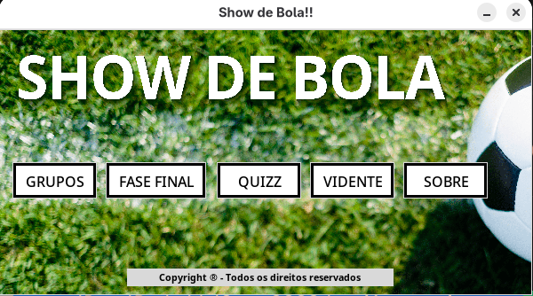
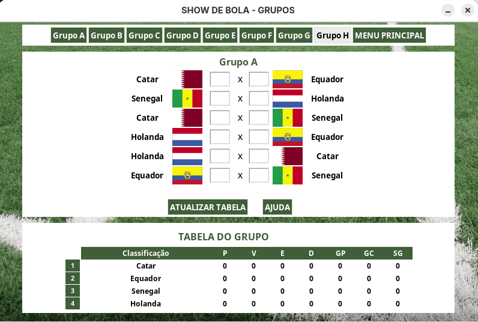
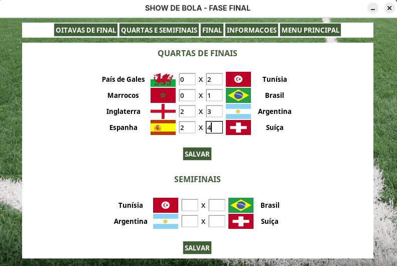

Here is the full English translation **with emojis and Markdown only** (no HTML tags):

---

# ⚽🏆 Show de Bola

**Show de Bola** is a desktop application developed to simulate, manage, and interact with World Cup data (with visual context from the 2022 World Cup). The system allows the user to fill in match scores, track standings tables, take a quiz, and even “predict” results.
*It was developed in an academic context for programming practice.*

## 📖 About the Project

This project was created as the **Final Assignment for the Object-Oriented Programming (OOP)** course at the Institute of Mathematics and Computer Science (ICMC) at the **University of São Paulo (USP)**.

* **Professor:** Márcio Delamaro
* **Context:** Management of a football championship.

## ✨ Features

The system is divided into 5 main modules accessible through the Main Menu:

### 1. 📊 Group Stage

* Visualization of all groups (A to H).
* **Match Simulation:** Users can enter match scores.
* **Dynamic Table:** The “Update Table” button automatically calculates standings, points (P), wins (W), draws (D), losses (L), goals for (GF), goals against (GA), and goal difference (GD).

### 2. 🚀 Knockout Stage

* Management of the elimination phases: Round of 16, Quarter-finals, Semi-finals, and Final.
* Score input to determine the teams advancing to the next stage.
* Data persistence via the “Save” button.

### 3. ❓ Quiz

* A question-and-answer game about World Cup history.
* Scoring system and immediate feedback.

### 4. 🔮 The Fortune Teller

* A fun module where the user selects two teams and the system “predicts” the winner.

### 5. ℹ️ About

* Institutional information and development team credits.

## 👥 Authors

Project developed by:

* **Carlos Filipe de Castro Lemos** (12542630)
* **João Gabriel Sasseron Roberto Amorim** (12542564)
* **Pedro Henrique Vilela do Nascimento** (12803492)
* **Pedro Guilherme dos Reis Teixeira** (12542477)

## 🛠️ Technologies Used

*(Fill this section with the actual technologies used in the code — e.g., Java, Java Swing/JavaFX, etc. Based on the interface style, it seems to be Java Swing.)*

* Language: **[Insert Language]**
* Graphical Interface: **[Insert UI Library]**

## 📸 Screenshots

|          Main Menu         |          Group Stage         |
| :------------------------: | :--------------------------: |
|  |  |

|         Knockout Phase         |            Quiz            |
| :----------------------------: | :------------------------: |
|  |  |

---

*© All rights reserved*
